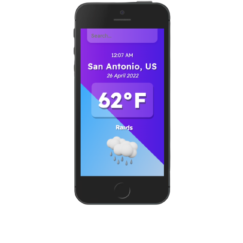

# Weather Application
This weather application is going to show you the current weather of the city you are searching. In the input you will type in any disired city and then press enter. The data will be pulled from Open Weather API, and it's free to use. The Main Objective of this application is to understand how to fetch in React.js and how to understnad hooks.  

## Environment Variables
To run this project, you will need to add the following environment variables to your file
`Weather_API_KEY`

## Roadmap
- Delete Unnecessary code / files to start the Initial Start
- App.js, Create the basic set up for the layout
  - [X] Input
  - [X] Time
  - [X] Date
  - [X] Location
  - [X] Temp
  - [X] Description
  - [X] Icon
- index.css, center and style the setup
  - [X] Background
  - [X] Input
  - [X] Time
  - [X] Date
  - [X] Location
  - [X] Temp
  - [X] Description
  - [X] Icon
- App.js
  - [X] Inside a function, an if statement to see if you pressed enter. 
  - [X] Inside the if statement once you press enter, fetch the url from weather API one call. 
    - we are using one call because we are  building only for mobile and only the current weather. 
  - [X] capture the value of input. 
  - [X] created a hook to capture the value and set it to a variable. 
  - [X] with API key, API call, and the hook variable searchedCityName
    - I UNDERSTAND THE API KEY IS NOT HIDDEN, THIS IS A FREE API AND ANYONE CAN GET ONE FOR FREE. 
- weather.main != undefined
  - [X] Need to create an if statement because when you first open the application your weather main is undefined. without this you will keep getting an error. 
  - [X] the else-if is going to be the home page, before the search. 
- Change to data inputs. 
  - [X] Change location to weather.main
  - [X] Change temperature and make sure its rounded the nearest whole number. 
  - [X] use the formula to turn it from kelvin to Fahrenheit
  - [X] Creating a constant variable/ function that will check to see the icon and then display the correct icon. 
- Evening Background - index.css
  - [X] create a new class for evening
  - [X] create a function that display the time in 24 hour
  - [X] get that time and make an if statement to see if it's greater than 18(6pm) the class will change. 
  - [X] style the evening class that will change the background and welcome colors. 

## Acknowledgements

- [React](https://reactjs.org/)
- [Google Fonts](https://fonts.google.com/)
- [You Probably Don't Need Moment.js Anymore](https://dockyard.com/blog/2020/02/14/you-probably-don-t-need-moment-js-anymore)
- [import or use images in ReactJS](https://www.tutorialswebsite.com/how-to-import-or-use-images-in-reactjs/)
- [Beautiful CSS box-shadow examples](https://getcssscan.com/css-box-shadow-examples)

